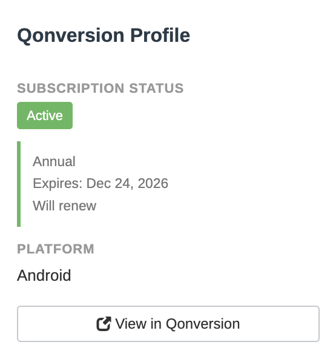

# Qonversion Integration for FreeScout

A FreeScout module that displays customer subscription information from Qonversion directly in the FreeScout conversation sidebar, allowing support agents to view customer subscription details without leaving the help desk interface.



## Features

- **Subscription Status** - View active, expired, or non-existent subscriptions at a glance
- **Platform Detection** - See which platform (iOS/Android) the customer uses
- **Direct Links** - One-click access to customer profiles in Qonversion dashboard
- **Real-Time Data** - Always shows current subscription status from Qonversion
- **Mailbox Selection** - Choose which mailboxes display the Qonversion sidebar
- **Clean UI** - Seamlessly integrated sidebar design matching FreeScout's aesthetic

## Requirements

- FreeScout: Version 1.8.0 or higher
- PHP: 7.4 or higher (8.0+ recommended)
- Qonversion Account: With API access enabled
- Server: Outbound HTTPS access to api.qonversion.io

## Installation

Clone the module into your FreeScout modules directory:

```bash
cd /var/www/html/Modules
sudo git clone https://github.com/YOUR-USERNAME/freescout-qonversion-integration.git QonversionIntegration
```

Set proper permissions:

```bash
sudo chown -R www-data:www-data QonversionIntegration
sudo chmod -R 755 QonversionIntegration
```

> Note: Replace www-data with your web server user if different (e.g., apache, nginx)

Clear FreeScout cache:

```bash
cd /var/www/html
sudo php artisan cache:clear
sudo php artisan config:clear
```

## Configuration

1. Activate the module in FreeScout via **Manage → Modules**
2. Configure module settings via **Manage → Settings → Qonversion**

Once configured, the module automatically displays subscription information in the conversation sidebar for customers in the selected mailboxes.

## How It Works

### Email-Based Identity Lookup

This module uses the customer's email address from FreeScout to query Qonversion's API. It requires that your app uses email addresses as Identity UIDs in Qonversion (which is a common setup).

### API Flow

1. Extract customer email from FreeScout conversation
2. Query Qonversion Identity API: `GET /v3/identities/{email}`
3. If found, fetch entitlements: `GET /v3/users/{user_id}/entitlements`
4. Parse subscription status and display in sidebar

## Troubleshooting

### Module Not Appearing

Check module is installed:

```bash
cd /var/www/html
php artisan module:list
```

You should see QonversionIntegration in the list.

Clear cache:

```bash
sudo php artisan cache:clear
sudo php artisan config:clear
```

### Sidebar Not Showing

- Verify module is activated in Manage → Modules
- Verify API credentials are configured in Manage → Settings → Qonversion
- Check that both Project Key and Project ID are filled in
- Check that the mailbox is selected in settings (or leave all unchecked to show in all mailboxes)
- Open a conversation and refresh the page

### "Subscription Status: None" for All Customers

Possible causes:

- Wrong Project Key - Verify your Project Key in Qonversion dashboard
- Email Mismatch - Ensure your app sends email as Identity UID to Qonversion
- Wrong Environment - Check if you're using Production vs Sandbox
- No Subscriptions - Customer may genuinely have no subscription history

Debug by checking logs:

```bash
sudo tail -f /var/www/html/storage/logs/laravel.log | grep -i qonversion
```

### API Connection Errors

Check server can reach Qonversion:

```bash
curl -I https://api.qonversion.io/v3/
```

Should return HTTP/1.1 401 Unauthorized (which is expected without credentials).

Check firewall allows outbound HTTPS:

- Ensure port 443 outbound is open
- Whitelist api.qonversion.io if using firewall rules

### Permission Errors

```bash
cd /var/www/html/Modules
sudo chown -R www-data:www-data QonversionIntegration
sudo chmod -R 755 QonversionIntegration
```

### View Detailed Error Logs

```bash
# View all logs
sudo tail -100 /var/www/html/storage/logs/laravel.log

# Watch logs in real-time
sudo tail -f /var/www/html/storage/logs/laravel.log

# Search for Qonversion-specific errors
sudo grep "Qonversion" /var/www/html/storage/logs/laravel.log
```

## Customization

### Adjust Styling

Modify `Public/css/module.css` to customize colors, spacing, or fonts.

### Modify Displayed Fields

Edit `Resources/views/sidebar.blade.php` to show/hide fields or change formatting.

After any changes, clear cache:

```bash
sudo php artisan cache:clear
```

## Performance Considerations

- **Real-Time Fetching**: Data is fetched fresh from Qonversion on each conversation view for accuracy.
- **Lazy Loading**: Data is only fetched when viewing a conversation, not on list pages.
- **Error Handling**: Failed API calls are logged but don't break the sidebar display.
- **Low Volume Optimized**: Ideal for support teams with moderate conversation volume.

## Security

- ✅ API key stored securely in FreeScout database
- ✅ API key masked in settings form
- ✅ All API requests use HTTPS
- ✅ No customer data stored locally
- ✅ Logs scrubbed of sensitive data

## Updating

### Update via Git

```bash
cd /var/www/html/Modules/QonversionIntegration
sudo git pull origin main
sudo php artisan cache:clear
sudo php artisan config:clear
```

### Manual Update

1. Download latest release
2. Backup your current installation
3. Replace files (keep your config if needed)
4. Clear cache

## Uninstalling

### Deactivate Only (Keep Files)

1. Go to Manage → Modules
2. Click Deactivate next to QonversionIntegration

### Complete Removal

```bash
cd /var/www/html/Modules
sudo rm -rf QonversionIntegration
cd /var/www/html
sudo php artisan cache:clear
sudo php artisan config:clear
```

Module settings will remain in database but won't be used.

## Contributing

Contributions are welcome! Here's how you can help:

- 🐛 Report Bugs - Open an issue with details
- 💡 Suggest Features - Open an issue with your idea
- 🔧 Submit PRs - Fork, branch, code, test, and submit

### Development Setup

```bash
git clone https://github.com/YOUR-USERNAME/freescout-qonversion-integration.git
cd freescout-qonversion-integration
# Make your changes
# Test thoroughly
git commit -m "Description of changes"
git push origin your-feature-branch
```

### Coding Standards

- Follow [PSR-12](https://www.php-fig.org/psr/psr-12/) coding standards
- Comment complex logic
- Test with FreeScout 1.8+ and PHP 8.0+
- Update README if adding features

## FAQ

**Q: Does this work with Stripe subscriptions managed by Qonversion?**  
A: Yes! The module works with any subscription source tracked by Qonversion (iOS, Android, Web/Stripe).

**Q: What if a customer has multiple email addresses?**  
A: The module uses the primary email address from the FreeScout conversation.

**Q: Can I see historical subscription data?**  
A: The sidebar shows current status. Click "View in Qonversion" for full history.

**Q: Does this slow down FreeScout?**
A: Minimally. API calls only happen when viewing conversations and have a 10-second timeout.

**Q: Can non-admin users see subscription data?**  
A: Yes. All users with access to conversations can see the sidebar data.

**Q: What data does this module send to Qonversion?**  
A: Only the customer's email address for lookup purposes.

## License

This module is open-source software licensed under the [MIT License](LICENSE).